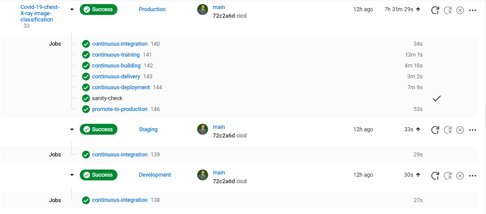
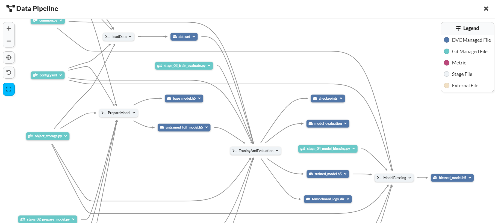

<p align="center">
    <b>
        <h1 align="center">COVID-19 Chest X-ray Image Classification</h1>
    </b>
</p>
<p align="center">
<a href="https://github.com/Hassi34/COVID-19-chest-X-ray-image-classification">
    
</a>
</p>
<p align="center">
<a href="https://github.com/Hassi34/COVID-19-chest-X-ray-image-classification">
    
</a>
</p>

<p align="center">
    <a href="https://www.python.org/downloads/">
        
    </a>
    <a href="https://github.com/Hassi34/COVID-19-chest-X-ray-image-classification">
        
    </a>
    <a href="https://github.com/Hassi34/COVID-19-chest-X-ray-image-classification">
        
    </a>
    <a href="https://github.com/Hassi34/COVID-19-chest-X-ray-image-classification">
        
    </a>
    <a href="https://github.com/Hassi34/COVID-19-chest-X-ray-image-classification">
        
    </a>
    <a href="https://github.com/Hassi34/COVID-19-chest-X-ray-image-classification/blob/main/LICENSE">
        
    </a>
    <a href="https://github.com/hassi34/COVID-19-chest-X-ray-image-classification/issues">
        
    </a>
    <a href="https://github.com/hassi34/COVID-19-chest-X-ray-image-classification/issues">
        
    </a>
</p>

Following are the major contents to follow, you can jump to any section:

>   -  [Introduction](#project-intro)<br>
>   -  [Project Notebooks](https://github.com/Hassi34/COVID-19-chest-X-ray-image-classification/tree/notebooks)
>   -  [Tech Stack](#tech-stack)<br>
>   -  [Infrastructure](#infra-)<br>
>   -  [DagsHub Data Pipeline](https://dagshub.com/hassi34/COVID-19-chest-X-ray-image-classification)
>   -  [Run Locally](#run-local)<br>
>      - [Environment Setup](#env-setup)<br>
>      - [Environment Variables](#env-vars)<br>
>      - [Run Pipeline](#run-pipeline)<br>
>      - [REST API with Docker](rest-api)<br>
>        - [Pull Image from Docker Hub](#docker-container)<br>
>        - [Docker Container](#docker-container)<br>
>   -  [Conclusion](#conclusion-)<br>

### Introduction<a id='project-intro'></a>
This project contains the production-ready Machine Learning solution for detecting and classifying Covid-19, Viral disease, and No disease in posteroanterior and anteroposterior views of chest x-ray

The objective is to minimize the healthcare operational cost and increse the effectiveness of the services by assisting the healthcare provider in accurate decision making.

## System Design


## CICD on Circleci

## DagsHub Data Pipeline
<br>
Complete Project Data Pipeline is available at [DagsHub Data Pipeline](https://dagshub.com/hassi34/COVID-19-chest-X-ray-image-classification)

## Tech Stack Used<a id='tech-stack'></a>
1. Python 
2. Data Version Control (DVC) 
3. Docker
4. Machine learning algorithms
5. MLFlow
6. Cloud Computing
7. SMTP Server

## Infrastructure<a id='infra-'></a>

1. DockerHub
2. Google Cloud Storage (GCS)
3. Google Artifact Registry
4. GitHub
5. DaghsHub
6. CircleCi
7. Google App Engine

## Run Locally<a id='run-local'></a>

* Ensure you have [Python 3.7+](https://www.python.org/downloads/) installed.

* Create a new Python Conda environment:<a id='env-setup'></a>

```bash
conda create -n venv python=3.10  
conda activate venv 
```
OR
* Create a new Python virtual environment with pip:
```bash
virtualenv venv
source venv/Scripts/activate
```
Install dependencies

```bash
  pip install -r requirements.txt
```

Clone the project

```bash
  git clone https://github.com/Hassi34/COVID-19-chest-X-ray-image-classification.git
```

Go to the project directory

```bash
  cd COVID-19-chest-X-ray-image-classification
```
Export the environment variable<a id='env-vars'></a>
```bash
# MLFlow
MLFLOW_TRACKING_URI=""
MLFLOW_TRACKING_USERNAME=""
MLFLOW_TRACKING_PASSWORD=""

#DockerHub 
DOCKERHUB_ACCESS_TOKEN=""
DOCKERHUB_USERNAME=""

#GCP
JSON_DCRYPT_KEY=""
GCLOUD_SERVICE_KEY=""
CLOUDSDK_CORE_PROJECT=""
GOOGLE_COMPUTE_REGION=""
GOOGLE_COMPUTE_ZONE=""

#Alerts
EMAIL_PASS=""
SERVER_EMAIL=""
EMAIL_RECIPIENTS=""

```

Run Pipeline<a id='run-pipeline'></a>

```bash
  dvc repro
```
## REST API with Docker<a id='rest-api'></a>
To run the following sequence of commands, make sure you have the docker installed on your system.

### Pull Image from Docker Hub<a id='docker-pull'></a>
In case you have not already pulled the image from the Docker Hub, you can use the following command:
```bash
docker pull hassi34/covid-19-chest-x-ray-image-classification
```

### Docker Container<a id='docker-container'></a>
Now once you have the docker image from the Docker Hub, you can now run the following commands to test and deploy the container to the web

* Run a Docker Container<a id='run-docker-container'></a><br>
Check all the available images:
```bash
docker images
```
Use the following command to run a docker container on your system:
```bash
docker run --name <CONTAINER NAME> -p 80:8080 -d <IMAGE NAME OR ID>
```
Check if the container is running:
```bash
docker ps
```
If the container is running, then the API services will be available on all the network interfaces<br>
To access the API service, type **``localhost``** in the browser.
## Conclusion<a id='conclusion-'></a>
This project is production ready to be used for the similar use cases and it will provide the automated and orchesrated production ready pipeline.
#### **Thank you for visiting 🙏 Your feedback would be highly appriciated 💯😊**<br>
#### **If you find this project useful then don't forget to star the repo ✨⭐🤖**<br>
#### 🌏[My Portfolio Website][website] <br><br>
#### **📃 License**
[MIT][license] © [Hasanain][website]

[license]: hhttps://github.com/Hassi34/COVID-19-chest-X-ray-image-classification/blob/main/LICENSE
[website]: https://hasanain.aicaliber.com

Let's connect on **[``LinkedIn``](https://www.linkedin.com/in/hasanain-mehmood)** <br>